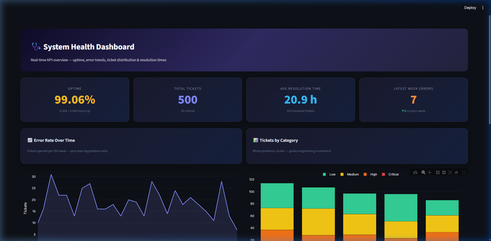
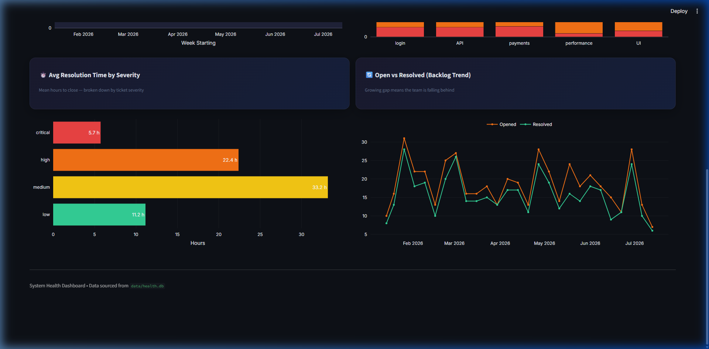

# System Health Dashboard

## Problem

Operations and engineering leadership lacked a single, at-a-glance view of platform reliability — uptime, error trends, and support-ticket health were spread across disconnected logs, spreadsheets, and ad-hoc queries. Without a consolidated dashboard, slow degradation went unnoticed and incident prioritisation was reactive instead of data-driven.

## Approach

| Layer | Detail |
|---|---|
| **Data generation** | `scripts/generate_data.py` — uses **Faker** + controlled random seeds to produce 500 realistic incident tickets (with severity, category, resolution time) and 4,300+ hourly uptime pings across a 6-month window. |
| **Storage & loading** | `scripts/load_to_sqlite.py` — loads the CSVs into a local **SQLite** database (`data/health.db`) with two tables: `tickets` and `uptime_events`. |
| **SQL KPIs** | Five purpose-built queries in `sql/` calculate the core metrics: 1. **Uptime %** — ratio of "up" hours to total hours 2. **Error Rate Over Time** — weekly ticket counts as a trend line 3. **Ticket Volume by Category** — breakdown across login, API, payments, performance, UI 4. **Avg Resolution Time** — mean hours to close, split by severity 5. **Open vs. Resolved** — weekly backlog delta to flag capacity issues |
| **Visualisation** | `app.py` — a **Streamlit** app using **Plotly** for interactive charts and custom CSS (Inter font, dark glassmorphism cards, gradient header) for a premium look. |
| **Reporting** | `docs/monthly_health_report.md` — a data-backed narrative report summarising June 2026 performance for stakeholders. |
| **Key libraries** | Python 3, Streamlit, Plotly, pandas, SQLite3, Faker |

## Outcome

### Scorecard KPIs & Error Trend

### Resolution Times & Backlog Trend

**Key findings from the dataset:**

- **99.06% overall uptime** (4,304 of 4,345 hours) — above the 99% SLA target.
- Ticket volume **fell 19.5%** month-over-month in June (87 → 70 tickets), with a clear weekly downtrend from 21 tickets in W22 to 5 in W26.
- **Payments** category carries the highest critical-severity concentration and the slowest average resolution time (22.99 hrs) — the recommended focus area.
- 77 tickets remain in the open backlog; every week in 2026 has added at least 1 net-new unresolved ticket.

---

📊 **Live dashboard:** `streamlit run app.py`

📄 **Monthly health report:** [docs/monthly_health_report.md](docs/monthly_health_report.md)

📋 **KPI definitions:** [docs/kpi-definitions.md](docs/kpi-definitions.md)
